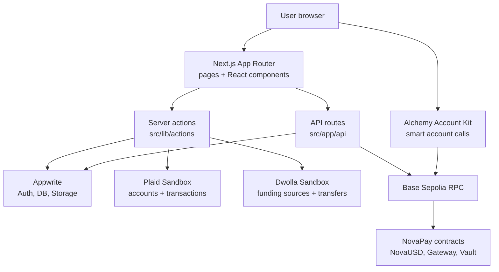
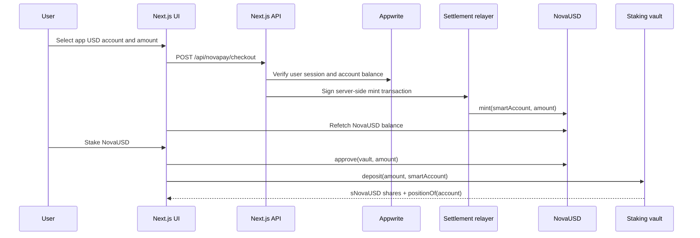
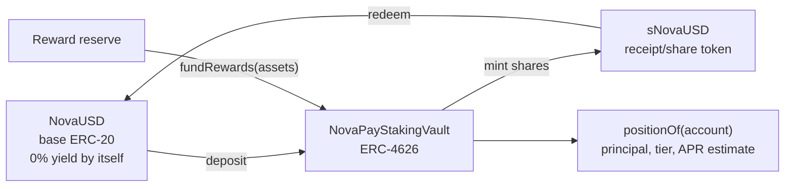

# NovaPay Bank Web Application

NovaPay is a hybrid finance dashboard and Base Sepolia staking MVP. The app combines a traditional banking interface powered by Appwrite, Plaid, and Dwolla with an EVM staking system built in Solidity and integrated through wagmi, TanStack Query, viem, and Alchemy smart accounts.

The project is currently a testnet/demo application. App USD balances are treated as application funds for the MVP, while on-chain NovaUSD and staking flows run on Base Sepolia.

## Current Architecture

The application has two main domains:

- Banking app: authentication, linked bank accounts, balances, transfers, dashboard, transaction history.
- Web3 staking: NovaUSD minting, ERC-4626 staking, sNovaUSD redemption, Base Sepolia reads/writes, Alchemy account abstraction support, and on-chain reward tier/accrual tracking.

### Web Application Architecture



The web app is split by responsibility:

| Layer | Main files | Responsibility |
| --- | --- | --- |
| Pages | `src/app/(root)/*` | Authenticated dashboard, banking, transfer, staking, and profile screens |
| UI components | `src/components/*` | Reusable banking UI, navigation, profile avatar, transaction tables, staking dashboard |
| Server actions | `src/lib/actions/*` | Appwrite users, bank records, Plaid, Dwolla, transaction persistence |
| API routes | `src/app/api/*` | NovaUSD checkout/redeem, staking fallback cache, profile image upload |
| Web3 client | `src/lib/web3/*` | Base Sepolia config, contract addresses, ABIs, formatting helpers |
| Smart contracts | `contracts/src/*` | NovaUSD, ETH gateway, ERC-4626 staking vault, oracle adapter |

### Data And Settlement Flow



### Staking And Reward Architecture



`NovaUSD` is the base token and does not earn yield by itself. `sNovaUSD` is the vault receipt token. The user's tier APR is attached to the staking position tracked by the vault, while real economic yield appears only when the reward reserve funds the vault and increases the share price.

## Main User Flows

### Banking

1. User signs up or signs in through Appwrite.
2. The app links bank accounts through Plaid.
3. Dwolla funding sources are created for transfer-like flows.
4. Dashboard pages display linked account balances and transactions.
5. Payment transfer pages create Dwolla transfers when available and persist local transaction records.

### App USD To NovaUSD

This is the MVP flow for "pay with own funds" from the banking application:

1. User selects an app funding account on the staking page.
2. User enters a USD amount.
3. Frontend calls `POST /api/novapay/checkout`.
4. API verifies the logged-in user and selected bank account.
5. API checks the selected account has enough available USD balance.
6. API signs a Base Sepolia transaction with a server-side settlement relayer key.
7. Relayer calls `NovaUSD.mint(recipient, amount)`.
8. Frontend refetches token balances and staking previews.

This flow is deliberately a demo settlement flow. It does not move real USD on-chain. The real-world version would need actual payment capture, reconciliation, and compliance logic before minting.

### NovaUSD To App USD

The MVP exit flow burns NovaUSD from the user's staking smart account and credits the selected app funding account in the Appwrite transaction ledger:

```text
NovaUSD.burn(amount) -> POST /api/novapay/redeem -> positive app USD transaction
```

This is a demo cash-out path for fictive app balances. A production version would need bank settlement, compliance checks, idempotency, and on-chain event verification before crediting cash.

### ETH Gateway To NovaUSD

The deployed gateway also supports a direct testnet ETH flow:

```text
Base Sepolia ETH -> NovaPayGateway.depositEth() -> NovaUSD
```

The gateway uses the Chainlink ETH/USD feed to quote NovaUSD output. This is useful for testing the on-chain path independently from app USD settlement.

### Staking

```text
NovaUSD -> approve vault -> deposit into ERC-4626 vault -> receive sNovaUSD
```

The vault is an ERC-4626 vault:

- Asset: `NovaUSD`
- Share token: `sNovaUSD`
- Position model: on-chain principal, reward tier, APR, and accrued rewards per user
- Reward preview: deterministic tier APR math through `InterestRateMath`
- Reward delivery: `fundRewards(assets)` adds NovaUSD to the vault, increasing `sNovaUSD` share value

Users redeem by burning `sNovaUSD` shares and receiving NovaUSD according to the current share price. User-specific tier rewards are tracked separately by `positionOf(account)` and displayed as an estimate; they are not paid through a separate claim path, which prevents double-paying the same reward budget.

### Reward Tracking

The current contract implementation keeps tier and accrued-interest tracking on-chain in `NovaPayStakingVault`. The frontend reads `positionOf(account)` and `previewAccrued(account)` when the deployed vault supports them.

The Appwrite staking position collection remains as a cache/fallback for old deployments that do not expose on-chain positions yet:

```text
GET /api/novapay/staking/position?account=<smartAccount>
```

Fallback write endpoints:

```text
POST /api/novapay/staking/record-deposit
POST /api/novapay/staking/record-redeem
```

Tier rules in the current on-chain model:

| Tier | Principal threshold | APR |
| --- | ---: | ---: |
| Starter | 0 NOVAUSD | 4% |
| Growth | 100 NOVAUSD | 7% |
| Prime | 1,000 NOVAUSD | 10% |

`Reference APR` is the legacy/global APR value kept in `vaultConfig()` and `vaultStats()` for compatibility and broad vault-level previews. It is not a separate automatic share APR. `Reward tier` is the user-specific APR that drives on-chain position accrual estimates. The active tier is selected from the user's tracked principal and returned by `positionOf(account)`.

The UI shows both values intentionally:

- `Reference APR`: global vault configuration and backwards-compatible dashboard metric.
- `Reward tier`: the APR applied to the user's current staked position.
- `Est. accrued interest`: estimated user-specific tier rewards from `previewAccrued(account)`.
- `Est. rewards/day`: projected daily rewards at the active tier APR.

The vault stores principal, estimated accrued interest, APR basis points, tier, and last accrual timestamp. The frontend polls contract reads and displays the on-chain snapshot. The reward reserve only needs to approve the vault when operators fund ERC-4626 yield through `fundRewards(assets)`.

### Security Audit And Mitigation

A focused Solidity audit pass was run on `contracts/src`. The generated report is stored in:

```text
NovaPay-Bank-Web-Application-pashov-ai-audit-report-20260607-194050.md
```

Main confirmed finding:

| Finding | Impact | Mitigation |
| --- | --- | --- |
| Double reward accounting in the staking vault | The previous design could pay the same reward twice: once through ERC-4626 share-price appreciation via `fundRewards()`, and again through a direct `claimRewards()` transfer from `rewardReserve`. | Removed the direct `claimRewards()` path. The protocol now has one economic reward channel: funded NovaUSD enters the vault, increases `sNovaUSD` share value, and users realize the value only when redeeming or withdrawing. |

Regression coverage:

- `testFundedRewardsAreRedeemedOnceThroughSharePrice()` verifies funded rewards are realized through ERC-4626 redemption.
- `testClaimRewardsSelectorIsNotExposed()` verifies the removed `claimRewards(address)` selector cannot be called.
- Full Foundry suite passed after mitigation: 52 tests, 0 failures.

Remaining audit leads that were not promoted to confirmed findings:

| Lead | Current treatment |
| --- | --- |
| Just-in-time reward capture around `fundRewards()` | Accepted as a known ERC-4626 timing/MEV risk for this MVP. Production mitigation would need funding epochs, snapshots, cooldowns, or time-weighted reward distribution. |
| Sequencer uptime feed hardening | Current oracle supports an optional sequencer feed. Production Base deployment should require a nonzero sequencer feed and validate sequencer round completeness. |
| `Reference APR` versus tier APR confusion | UI/docs now label the global value as `Reference APR`; actual user estimates use `Reward tier` APR from `positionOf(account)`. |

### Account Abstraction

The staking page supports an Alchemy smart account flow:

1. User authorizes an owner wallet.
2. App creates or recovers an Alchemy smart account.
3. Smart account address is stored locally.
4. Smart account can receive ETH and NovaUSD.
5. Staking actions can be sent through Alchemy wallet APIs.

For the app USD checkout, the recommended recipient is the smart account when it exists, because staking actions are performed from that account.

## Deployed Base Sepolia Contracts

Owner and reward reserve:

```text
0xC3616f92ecEEabb61fa0BC7f14b70aC531c8D63d
```

Contracts:

```text
NovaUSD:                0x9d8c401729329eD0519F3A0b58beA6dE03F5C586
ChainlinkPriceOracle:   0xeF62Bbf4a619dB6d3B74691867cCa624BF249002
NovaPayGateway:         0x6B16077031d67C915557531CcDAdc8742Aa23541
NovaPayStakingVault:    0x2bdF56d0011dF5E135D2d7B0014d92f7dF892FE1
```

Oracle feed:

```text
Base Sepolia ETH/USD Chainlink feed:
0x4aDC67696bA383F43DD60A9e78F2C97Fbbfc7cb1
```

The app USD checkout uses a server-side settlement relayer. The relayer address and role management are operational details and should be kept out of public documentation.

## Repository Structure

```text
src/app
  Next.js App Router pages and API routes

src/app/api/novapay/checkout/route.ts
  App USD checkout endpoint that verifies app balances and relays NovaUSD minting

src/app/api/novapay/redeem/route.ts
  Demo NovaUSD cash-out endpoint that records app USD credit after token burn

src/app/api/profile-picture/route.ts
  Profile image upload endpoint backed by Appwrite Storage

src/components
  Banking UI, auth UI, sidebar, dashboard, transactions, staking dashboard

src/lib/actions
  Server actions for Appwrite users, banks, transactions, Plaid, and Dwolla

src/lib/web3
  Base Sepolia chain config, wagmi config, contract addresses, ABIs, formatting helpers

contracts
  Foundry workspace with Solidity contracts, tests, deployment scripts

docs
  Architecture and AI handoff notes
```

## Smart Contracts

Main contracts:

- `NovaUSD`: ERC-20 testnet asset with owner-managed minters.
- `NovaPayGateway`: accepts Base Sepolia ETH and mints NovaUSD using an ETH/USD oracle.
- `NovaPayStakingVault`: ERC-4626 vault that accepts NovaUSD, issues `sNovaUSD`, tracks user reward tiers, and exposes estimated accrued rewards on-chain.
- `ChainlinkPriceOracle`: validates Chainlink price data and optional L2 sequencer status.
- `InterestRateMath`: pure APR reward preview library.

Contract docs and deployment commands live in `contracts/README.md`.

## Environment Variables

Create `.env` in the project root. Do not commit it.

### Appwrite

```env
NEXT_PUBLIC_APPWRITE_ENDPOINT=
NEXT_PUBLIC_APPWRITE_PROJECT=
APPWRITE_SECRET=
APPWRITE_DATABASE_ID=
APPWRITE_USER_COLLECTION_ID=
APPWRITE_BANK_COLLECTION_ID=
APPWRITE_TRANSACTION_COLLECTION_ID=
APPWRITE_STAKING_POSITION_COLLECTION_ID=
APPWRITE_PROFILE_BUCKET_ID=
```

The staking position collection requires these string attributes:

```text
userId
smartAccount
principal
accrued
aprBps
tier
lastAccruedAt
status
```

Profile images use Appwrite Storage bucket `profile_pictures` and optional user collection string attributes:

```text
profileImageId
profileImageUrl
```

### Plaid

```env
PLAID_CLIENT_ID=
PLAID_SECRET=
PLAID_ENV=sandbox
PLAID_PRODUCTS=auth,transactions
PLAID_COUNTRY_CODES=US
```

### Dwolla

```env
DWOLLA_KEY=
DWOLLA_SECRET=
DWOLLA_BASE_URL=https://api-sandbox.dwolla.com
DWOLLA_ENV=sandbox
```

### Web3

```env
NEXT_PUBLIC_BASE_SEPOLIA_RPC_URL=https://sepolia.base.org
NEXT_PUBLIC_ALCHEMY_API_KEY=
NEXT_PUBLIC_NOVAPAY_NOVAUSD_ADDRESS=0x9d8c401729329eD0519F3A0b58beA6dE03F5C586
NEXT_PUBLIC_NOVAPAY_GATEWAY_ADDRESS=0x6B16077031d67C915557531CcDAdc8742Aa23541
NEXT_PUBLIC_NOVAPAY_STAKING_VAULT_ADDRESS=0x2bdF56d0011dF5E135D2d7B0014d92f7dF892FE1
```

## Token Metadata And BaseScan Logos

Local metadata files:

```text
public/token-metadata/novausd.json
public/token-metadata/snovausd.json
```

Current Base Sepolia token profile values:

| Token | Address | Decimals | Logo CID |
| --- | --- | ---: | --- |
| NovaUSD | `0x9d8c401729329eD0519F3A0b58beA6dE03F5C586` | 18 | `bafybeieeo3saecpatlclesfw6ahgqo3vke2vo4olqhkskjoymmpo4nldha` |
| sNovaUSD | `0x2bdF56d0011dF5E135D2d7B0014d92f7dF892FE1` | 24 | `bafybeiddvf2qbdcd6xzdescpkb654nr42srukb4revsltd3oyqsotrg6ha` |

BaseScan does not read project-local metadata files automatically. Submit token info through BaseScan's "Update Token Info" flow for each deployed token address and wait for review before the logo appears on the explorer.

### Settlement Relayer

The app USD checkout requires a server-only settlement signer configured in the deployment environment. Do not expose relayer private keys or role-management commands in public docs or `NEXT_PUBLIC_*` variables.

## Setup

Install dependencies:

```bash
npm install
```

Run the Next.js app:

```bash
npm run dev
```

Open:

```text
http://localhost:3000
```

Run TypeScript checks:

```bash
npx tsc --noEmit
```

Run lint:

```bash
npx eslint src/app src/components src/lib
```

The broad `npm run lint` may also scan vendored Solidity dependencies under `contracts/lib` depending on local ESLint behavior. Prefer targeted lint commands for frontend files.

Initialize Appwrite support collections/buckets:

```bash
npm run appwrite:staking:init
npm run appwrite:profile:init
```

## Testing And Coverage

The repository has two independent test suites: the Next.js web app tests run from the project root with Vitest, and the Solidity tests run from `contracts/` with Foundry.

### Web App Tests

Run the web app unit tests:

```bash
npm test
```

Run web app test coverage:

```bash
npm run test:coverage
```

Coverage is scoped to `src/**/*.test.ts` through `vitest.config.ts`. The current web suite covers:

- staking tier selection and APR accrual math in `src/lib/staking.utils.ts`
- web3 token parsing, formatting, BPS formatting, and address compaction in `src/lib/web3/format.ts`
- general formatting and transaction category helpers in `src/lib/utils.ts`

Vitest writes LCOV output to `coverage/lcov.info`. The `coverage/` directory is generated output and should not be committed.

Current local snapshot:

| Suite | Tests | Statements | Branches | Functions | Lines |
| --- | ---: | ---: | ---: | ---: | ---: |
| Web app Vitest | 15 passing | 73.64% | 78.57% | 65.51% | 72.35% |

### Contract Tests

From the `contracts` folder, run the Solidity suite:

```bash
forge test
```

Run Solidity coverage:

```bash
forge coverage
```

The Foundry suite covers:

- `NovaUSD` minter permissions, user burn support, and owner controls
- `NovaPayGateway` ETH-to-NovaUSD minting and oracle failure cases
- `NovaPayStakingVault` ERC-4626 deposits, redemptions, reward tier tracking, accrued reward previews, funded reward redemption, and removed `claimRewards` selector regression
- vault invariants for share/asset accounting

Foundry coverage is useful for local review, but the generated `contracts/out/` and coverage artifacts should not be treated as source documentation.

Current local snapshot:

| Suite | Tests | Lines | Statements | Branches | Functions |
| --- | ---: | ---: | ---: | ---: | ---: |
| Contracts Foundry | 52 passing | 78.18% | 77.08% | 55.56% | 83.58% |

## Foundry Commands

From the `contracts` folder:

```bash
forge build
forge test
forge coverage
forge fmt
```

Deploy to Base Sepolia:

```bash
forge script script/DeployNovaPay.s.sol:DeployNovaPay \
  --rpc-url https://sepolia.base.org \
  --account <foundry-keystore-account> \
  --broadcast
```

## Operational Notes

- The settlement relayer is a separate server-side wallet used by the backend to mint NovaUSD after app USD checkout.
- Never use the protocol owner private key as the settlement relayer key.
- Restart the Next.js dev server after changing `.env`.
- App USD balances are currently read from Plaid account data and are treated as demo funds.
- App USD checkout does not currently debit a real bank balance. It validates available balance and mints NovaUSD for the MVP.
- NovaUSD cash-out currently burns NovaUSD and records app USD credit in the demo ledger. It is not a real fiat redemption rail.
- Token metadata files live in `public/token-metadata/`; BaseScan logo display still requires submitting token info through BaseScan's token update process.
- Production settlement would need real payment capture, idempotency keys, reconciliation, fraud controls, and delayed minting until payment finality.

## Current Limitations

- Base Sepolia only.
- App USD checkout is demo settlement, not real fiat settlement.
- The settlement relayer is trusted and can mint NovaUSD while it has minting permission.
- Smart account address is stored in browser local storage.
- Staking tier yield is estimated on-chain, but real yield appears only after the reward reserve funds the vault.
- No production paymaster policy is configured yet.

## Recommended Next Steps

1. Add idempotency to `POST /api/novapay/checkout` so refresh/retry cannot mint twice.
2. Persist NovaUSD checkout status in Appwrite with `pending`, `confirmed`, and `failed` states.
3. Add toast notifications for checkout, approve, stake, and redeem.
4. Add event-driven or block-driven refetch after `Transfer`, `Approval`, `Deposit`, and `Withdraw` events.
5. Add a dedicated admin script for granting and revoking `NovaUSD` minter roles.
6. Add tests for the checkout route and settlement edge cases.
7. Decide whether production NovaUSD should be backed by real payment settlement, USDC, or remain a demo token.

## Security Notes

- Settlement private keys must stay server-only. They must never be exposed through `NEXT_PUBLIC_*`.
- The relayer wallet should hold only enough Base Sepolia ETH for gas.
- Owner operations should use encrypted Foundry keystore accounts.
- Minter permissions should be revoked from any unused relayer.
- Mainnet deployment would require a real economic model and a separate audit.
