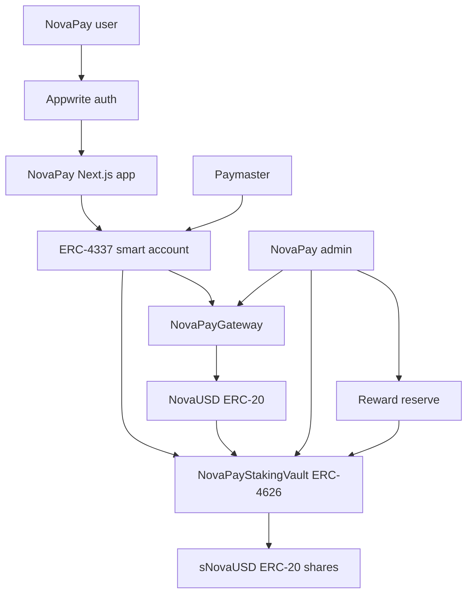
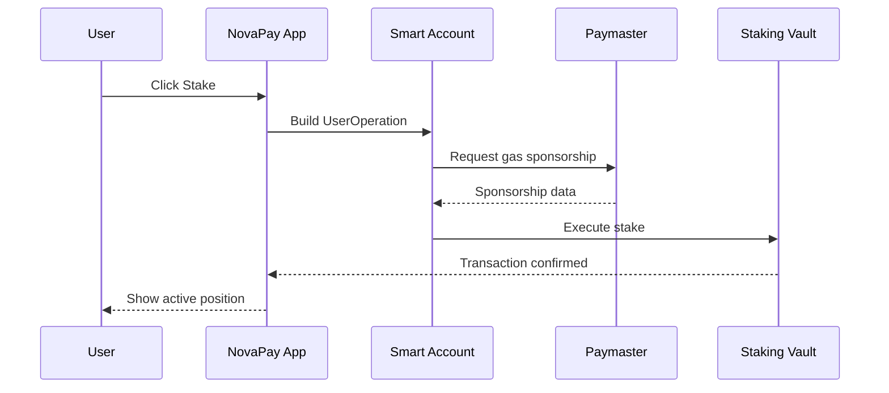

# NovaPay Staking Architecture

## 1. Scope

This document defines the first technical version of the NovaPay staking system. The goal is to model a real EVM-based staking product that can be deployed on a testnet, integrated into the existing NovaPay application, and later extended with account abstraction.

The first implementation target is Base Sepolia or another EVM testnet with low operational cost. The system should not depend on a locally running blockchain node.

## 2. Design Goals

- Provide a real on-chain staking flow using Solidity smart contracts.
- Use OpenZeppelin contracts where possible instead of custom primitives.
- Keep the first staking product simple enough to test and explain clearly.
- Support a walletless user experience later through ERC-4337 smart accounts.
- Keep interest rate logic deterministic and easy to verify.
- Avoid promising real economic yield before a real reward source exists.

## 3. Non-Goals

- No mainnet deployment in the first phase.
- No dynamic lending-market yield in the first phase.
- No utilization-based rate model until there is a real capital use case.
- No custom account abstraction implementation from scratch.
- No production-grade tokenomics before testnet behavior is validated.

## 4. High-Level Architecture



The application remains the user's main interface. Blockchain interactions are introduced behind the NovaPay staking page, then progressively moved toward ERC-4337 smart accounts for a smoother user experience.

## 5. Contract Components

### 5.0 Token Flow

The first version uses two application tokens:

- `NovaUSD`: the base ERC-20 asset used inside NovaPay.
- `sNovaUSD`: the ERC-4626 vault share token received when a user stakes `NovaUSD`.

The intended user flow is:

```text
deposit test ETH -> mint NovaUSD -> stake NovaUSD -> receive sNovaUSD
```

`sNovaUSD` is an interest-bearing ERC-20. It represents a proportional claim on the assets held by the staking vault. When the vault receives rewards, the value of each `sNovaUSD` share increases relative to `NovaUSD`.

Example:

```text
Initial state:
1000 NovaUSD in vault
1000 sNovaUSD issued
1 sNovaUSD = 1 NovaUSD

After rewards are added:
1100 NovaUSD in vault
1000 sNovaUSD issued
1 sNovaUSD = 1.1 NovaUSD
```

This design keeps the staking token standard and composable. It also avoids custom reward accounting for the first version.

### 5.0.1 Interfaces And Shared Structs

Contract-facing interfaces live in `contracts/src/interfaces/`.

The interfaces define the structs that are useful for both contract composition and frontend/backend reads:

- `IPriceOracle.PriceData`
- `INovaPayGateway.GatewayConfig`
- `INovaPayGateway.MintQuote`
- `INovaPayStakingVault.VaultConfig`
- `INovaPayStakingVault.VaultStats`
- `INovaPayStakingVault.RateConfig`
- `INovaPayStakingVault.RewardPreview`

This keeps getter return types explicit and avoids forcing the frontend to reconstruct dashboard data from many unrelated calls.

Interest-rate logic is deliberately kept small:

- `INovaPayStakingVault`: exposes the vault's APR configuration and reward previews.
- `InterestRateMath`: pure library for deterministic APR/reward calculations.
  The library should use OpenZeppelin `Math.mulDiv` for percentage and time-based
  reward calculations instead of raw chained multiplication.

Rationale:

A Solidity library is the right place for stateless math. The first version does not need an on-chain interest-rate model contract because the APR policy is simple vault state, not an independent protocol component. This avoids unnecessary external calls and keeps the ERC-4626 vault as the single contract users interact with for staking.

### 5.1 NovaUSD

`NovaUSD` is a testnet ERC-20 asset used as the staking token.

Responsibilities:

- Represent the token users deposit into the staking vault.
- Allow controlled minting on testnet for demos and development.
- Support standard ERC-20 transfers and approvals.

Recommended base contracts:

- `ERC20`
- `Ownable` or `AccessControl`
- Optional: `ERC20Permit`

Initial functions:

- `mint(address to, uint256 amount)`
- standard ERC-20 methods inherited from OpenZeppelin

Security notes:

- Minting must be admin-only.
- On testnet, minting is acceptable for demo liquidity.
- On mainnet, this would need a real asset or a clearly defined economic model.

### 5.2 NovaPayGateway

`NovaPayGateway` is the testnet on-ramp contract. It accepts test ETH and mints `NovaUSD` at a fixed demo rate.

Responsibilities:

- Accept test ETH deposits.
- Mint `NovaUSD` to the depositor.
- Keep the ETH-to-NovaUSD rate configurable by the owner.

Recommended base contracts:

- `Ownable`
- `Pausable`
- `ReentrancyGuard`

Initial functions:

- `depositEth() payable`
- `setMintRate(uint256 newRate)`
- `pause()`
- `unpause()`

Testnet-only rule:

- The first version may use a fixed rate such as `1 ETH = 1000 NovaUSD`.

Mainnet note:

- This gateway is not a production stablecoin design. On mainnet, NovaPay should use a real asset such as USDC, or a separately designed collateral and oracle system.

### 5.3 NovaPayStakingVault

`NovaPayStakingVault` is the main staking contract. It should be based on ERC-4626 where practical because ERC-4626 standardizes tokenized vault deposits, shares, withdrawals, and accounting.

Responsibilities:

- Accept NovaUSD deposits.
- Issue `sNovaUSD` vault shares.
- Represent staking yield through ERC-4626 share price appreciation.
- Receive reward funding from the reward reserve.
- Allow users to redeem `sNovaUSD` for `NovaUSD`.
- Prevent unsafe operations when paused.

Recommended base contracts:

- `ERC4626`
- `ERC20` through `ERC4626`
- `Ownable` or `AccessControl`
- `Pausable`
- `ReentrancyGuard`

Vault token metadata:

```text
name: Staked NovaUSD
symbol: sNovaUSD
asset: NovaUSD
```

Rationale:

For the first version, `sNovaUSD` should behave like a standard interest-bearing token. This means a user's yield is reflected by the vault exchange rate, not by a separate custom reward claim. This is simpler, more standard, and easier to integrate.

Initial user actions:

- `deposit(uint256 assets, address receiver)`
- `mint(uint256 shares, address receiver)`
- `withdraw(uint256 assets, address receiver, address owner)`
- `redeem(uint256 shares, address receiver, address owner)`

Initial admin actions:

- `pause()`
- `unpause()`
- `setAprBps(uint256 newAprBps)`
- `setRewardReserve(address newRewardReserve)`
- `fundRewards(uint256 assets)`

### 5.4 InterestRateMath

`InterestRateMath` contains the target reward math. It is a Solidity library, not an on-chain contract.

Responsibilities:

- Calculate the reward amount needed for a given vault principal, APR, and elapsed time.
- Keep reward math deterministic.
- Keep math separately testable from ERC-4626 deposit and withdrawal behavior.

Recommended first configuration:

- One fixed APR for the first vault.
- APR changes affect future reward funding calculations.
- Existing `sNovaUSD` holders benefit from any rewards actually funded into the vault.

Example APR:

| Vault | APR | APR bps |
| --- | ---: | ---: |
| sNovaUSD | 7% | 700 |

Vault-facing structs:

```solidity
interface INovaPayStakingVault {
    struct RateConfig {
        uint256 aprBps;
        uint256 yearInSeconds;
    }

    struct RewardPreview {
        uint256 principal;
        uint256 aprBps;
        uint256 elapsedTime;
        uint256 reward;
    }

    function rateConfig() external view returns (RateConfig memory config);

    function aprBps() external view returns (uint256);

    function previewReward(
        uint256 principal,
        uint256 elapsedTime
    ) external view returns (RewardPreview memory preview);
}
```

Reward formula:

```text
reward = principal * aprBps * elapsedTime / (10_000 * YEAR)
```

Constants:

```text
BPS = 10_000
YEAR = 365 days
```

Example:

```text
vault principal = 1000 NovaUSD
aprBps = 700
elapsedTime = 90 days

reward = 1000 * 700 * 90 / (10_000 * 365)
reward ~= 17.26 NovaUSD
```

### 5.5 RewardReserve

The reward reserve is the source of reward payments.

Responsibilities:

- Hold NovaUSD used to pay staking rewards.
- Make the system honest about where yield comes from.
- Prevent the vault from pretending yield exists without backing assets.

First version:

- Can be a dedicated address controlled by NovaPay.
- Can be implemented as contract logic later if needed.

Rules:

- Rewards are not created out of nothing.
- The vault's share price increases only when rewards are funded with real `NovaUSD`.
- If the reserve cannot fund rewards, `sNovaUSD` does not accrue new value for that interval.

## 6. Interest Rate Model Decision

The first version should use one fixed target APR for the `sNovaUSD` vault.

Reasons:

- Easy to explain in the diploma paper.
- Easy to test with deterministic unit tests.
- No dependency on external protocols or oracles.
- No hidden assumptions about lending demand or capital utilization.
- Clear user experience: users know the target APR before staking.
- Consistent with one ERC-4626 share token and one exchange rate.

Rejected for phase one:

- Utilization-based APR, because it requires a real borrowing/yield strategy.
- Oracle-based APR, because it introduces external dependencies.
- Rebasing rewards, because it complicates accounting and UI.
- Auto-compounding, because it introduces more state transitions and edge cases.
- Multiple APR tiers inside one ERC-4626 vault, because a single vault share token has one exchange rate.

Future extension:

```text
utilization = borrowedAssets / totalAssets
apr = baseRate + utilization * slope
```

This should be added only after NovaPay defines how staked capital is productively used.

Lock tiers can be added later by deploying separate ERC-4626 vaults:

```text
sNovaUSD30  -> 30 day vault
sNovaUSD90  -> 90 day vault
sNovaUSD180 -> 180 day vault
```

Each vault would have its own APR and its own share token. This preserves ERC-4626 accounting correctness.

## 7. Staking Rules

Initial rules:

- A user deposits `NovaUSD` into the vault.
- The vault issues `sNovaUSD` shares.
- Rewards are represented by share price appreciation.
- There is no separate claim function in the first version.
- Users redeem or withdraw to convert `sNovaUSD` back into `NovaUSD`.
- Admin APR changes do not directly mint rewards; the reward reserve must still fund the vault.

Optional later rules:

- Early withdrawal with penalty.
- Auto-compounding.
- NFT receipt for each position.
- Transferable stake positions.
- Separate lock-tier vaults.

## 8. Account Abstraction Integration

The staking contracts should be compatible with normal EOAs first. Account abstraction is an application integration layer added after contract behavior is verified.

Planned flow:



The smart account layer should not be required for contract tests. This keeps the contract system independently verifiable.

## 9. Security Considerations

- Use OpenZeppelin implementations for ERC-20, ERC-4626, `Ownable`, `Pausable`, and `ReentrancyGuard`.
- Add minimum deposit checks to reduce rounding problems.
- Consider ERC-4626 inflation attack mitigations before production.
- Use `nonReentrant` around ETH deposits, reward funding, deposits, withdrawals, and redemptions where custom logic wraps token movement.
- Use `SafeERC20` for transfers.
- Avoid hidden reward creation; rewards must be funded explicitly.
- Keep reward funding explicit.
- Add pause controls for emergency response.

## 10. Test Plan

Unit tests:

- `NovaUSD` mints only from authorized account.
- `NovaPayGateway` mints the expected `NovaUSD` amount for deposited test ETH.
- `NovaPayStakingVault` returns the configured APR.
- `calculateReward` returns expected values for 30, 90, 180, and 365 day examples.
- vault deposit issues `sNovaUSD`.
- vault redeem returns `NovaUSD`.
- funding rewards increases `convertToAssets(1 sNovaUSD)`.
- paused gateway blocks ETH deposits.
- paused vault blocks deposits, withdrawals, and redemptions.

Integration tests:

- deploy token, gateway, and vault.
- mint NovaUSD to user.
- approve vault.
- deposit into vault.
- fund rewards.
- confirm share price appreciation.
- redeem shares.

Testnet checks:

- deploy to Base Sepolia.
- verify contracts.
- run one full ETH deposit, NovaUSD mint, vault deposit, reward funding, redeem flow.
- read position data from NovaPay UI.

## 11. Implementation Order

1. Create Foundry contracts workspace.
2. Install OpenZeppelin Contracts.
3. Implement `NovaUSD`.
4. Implement `NovaPayGateway`.
5. Implement `NovaPayStakingVault`.
6. Write unit tests for reward math.
7. Write unit tests for gateway and vault lifecycle.
8. Deploy to Base Sepolia.
9. Integrate NovaPay UI and backend.
10. Add ERC-4337 smart account flow.

## 12. Open Questions

- Which EVM testnet should be the primary target: Base Sepolia or Polygon Amoy?
- Should NovaPay sponsor gas from day one, or only after basic staking works?
- Should the first UI expose only the `sNovaUSD` vault, or also show future lock-tier placeholders?
- Should `NovaPayGateway` be included in the first deploy, or should users receive `NovaUSD` through a faucet action?
